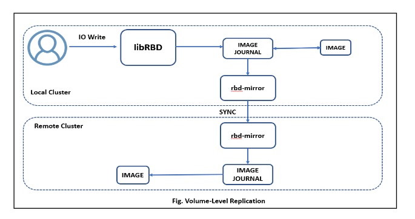
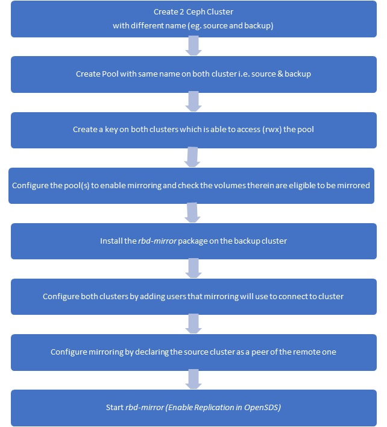
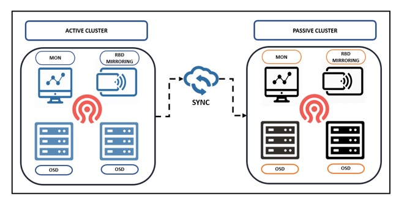

#Ceph Volume Level Replication Design

**Author:** [Click2Cloud](https://github.com/Click2Cloud-Gamma)

This documentation serves as the design spec for Ceph Volume Level Replication.

### Background 

Currently there is no mechanism for Ceph Volume level replication in OpenSDS. Volume Replication for Ceph will be introduced as step to support Ceph Volume level Replication.

### Goals

*	One-way Volume Level Replication.

### Non-Goals

*	Two-way Volume Level Replication.

### Prerequisites:

*	Ceph storage clusters on both sites and the two clusters are named differently.Primary Cluster name should be "ceph" and Secondary Cluster name should be "remote".

*	Replication only works between 2 different Ceph clusters.

*   Both machine should have SSH passwordless Login

    Steps for SSH passwordless login on both machine
     
     * ssh-keygen
     
     * ssh remote-machine_name@machine-IP_Anothermachine

     
*  In Ceph.yaml file enable replication section. 
        
        Primary Cluster machine IP,username, password and .conf filepath set in hostip,hostusername,hostpassword,hostDialIP,hostfilepath.
        
        Remote Cluster machine Ip,username ,password and .conf filepath set in PeerIp, PeerUsername,PeerPassword, peerDialIP, peerfilePath    
        
        
 * Enable *host_based_replication_driver = ceph* in opensds.conf file.  
 
 ### Installation of OpenSDS 
 On both machine install opensds.  
 
 On Remote Cluster machine while installing opensds change cluster: ceph to **cluster: remote** in "opensds-installer/ansible/group_vars/ceph/all.yml"
 
 [OpenSDS-installation](https://github.com/opensds/opensds/wiki/OpenSDS-Cluster-Installation-through-Ansible)
  
 ### Architecture Diagram
 
 One-way Replication implies that a primary volume in one cluster gets replicated in a secondary cluster. In the secondary or remote cluster, the replicated volume is non-primary; that is, block device clients cannot write to volume.
 
 
 One-way Replication is appropriate for maintaining a crash-consistent copy of volume. One-way Replication may not be appropriate for all situations, such as using the secondary volume for automatic failover and failback with OpenStack, since the cluster cannot failback when using one-way replication.

 Following workflow describe setting up a one-way mirror between distinct Ceph clusters: one cluster acts as the source, and the other is the backup. In this example, mirror is enabled per-pool.
 
 
 
 ##### Flow Chart 
 
 
  
### How RBD Mirroring Work?

*	RBD mirror will be responsible for synchronizing volume from one cluster to another.

*	The daemon will be configured on both sites and it will simultaneously connect to both primary(ceph) and remote clusters. 

*	Initial point, it will connect to the other CEPH Cluster using configuration file (to find the monitors) user and a key. 

*	The RBD-Mirror daemons use the Cephx mechanism to authenticate with the monitor, to know each other individual will have to register the other one more precisely other cluster.
     

    
   There are two RBD volume features
   
   *	Journaling: Enables journaling for every transaction on the volume.
   
   *	Mirroring: Which explicitly tells the RBD-Mirror daemon to replicate this volume.
    
 The Journal maintains a list of record for all the transactions on the volume. In general, a write would first go to the journal, back to the client and then be written to the RBD volume. The Mirroring can be enabled and disabled on entire pool or per volume basis. If it enabled on a pool every volume that have a journaling feature enabled will get replicated by the mirror agent.
 
 
 ### References
 
[RBD Mirroring](http://docs.ceph.com/docs/mimic/rbd/rbd-mirroring/)
 
 [LIBRBD (Python)](http://docs.ceph.com/docs/mimic/rbd/api/librbdpy/)
 
 [Ceph-rados-gateway-apis](http://docs.ceph.com/docs/mimic/api/#ceph-rados-gateway-apis)
 
 [Ceph-block-device-apis](http://docs.ceph.com/docs/mimic/api/#ceph-block-device-apis)
